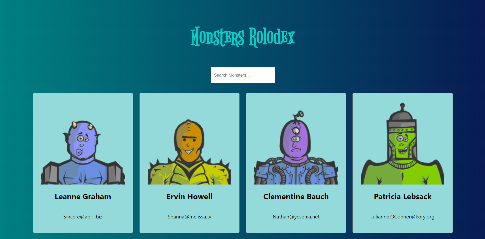

# Monster's Rolodex

Learn using **Class Components** and **Function Components** in React.

Live: [**https://trinhminhnhat.github.io/react-monsters-rolodex**](https://trinhminhnhat.github.io/react-monsters-rolodex)

## ⚓ Environment

- Node 19.3.0

## 🚀 Technologies Used

- react 18.2.x

## 📖 References

Learned from a [**Complete React Developer in 2023 (w/ Redux, Hooks, GraphQL)**](https://www.udemy.com/course/complete-react-developer-zero-to-mastery) in an Udemy course.
